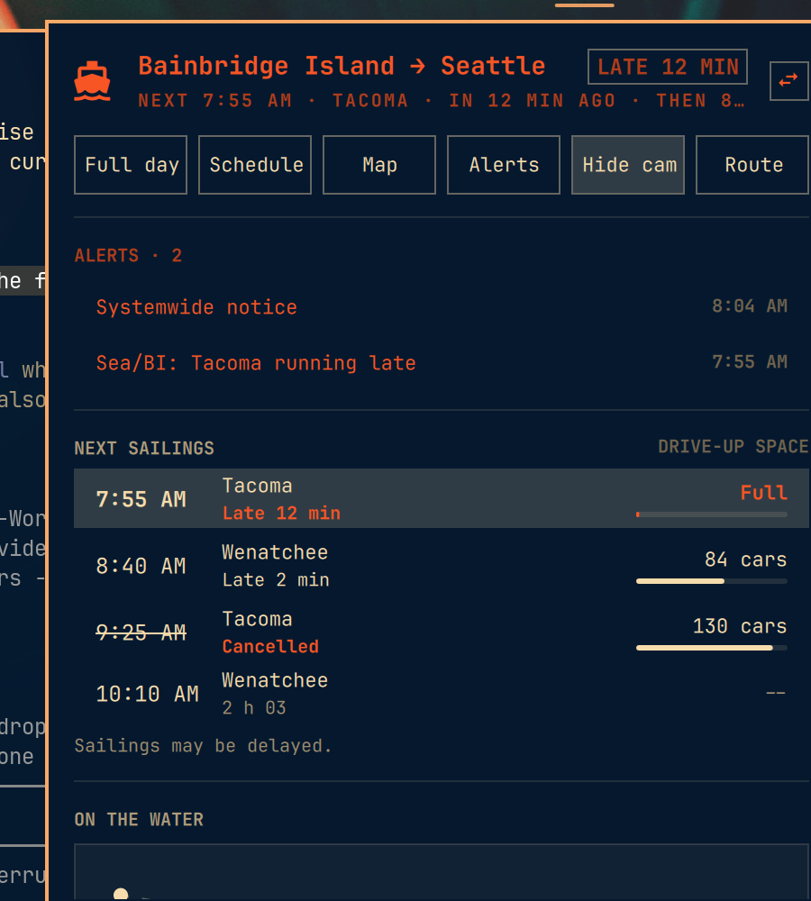
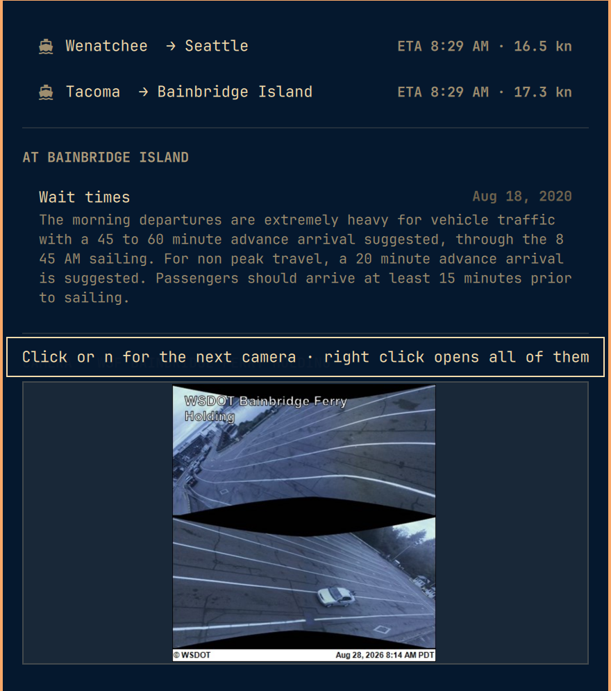

# Ferries widget for Omarchy

A native Omarchy bar widget that answers the questions you actually have when
you are heading for a ferry: when is the next boat, when is the one after it,
is it late, how many car spaces are left, where are the boats right now, and
is there anything the operator wants you to know.

Washington State Ferries first. Other ferry systems drop in as providers
without touching the panel (see [providers/README.md](providers/README.md)).





## What it shows

**In the bar:** a ferry icon and a countdown to the next sailing (`12m`,
`1h05`, `now`). When the boat is late at the dock the countdown becomes how
late it is (`+8m`) in the urgent colour. Cancelled next sailing: urgent too.
Alerts alone never light the bar up; WSF posts a lot of them, and an icon that
is always red means nothing.

**In the panel:**

- **Hero.** Route, next sailing, boat, minutes to go, then the sailing after
  it. A pill with the next sailing's status (`ON TIME`, `LATE 8 MIN`,
  `CANCELLED`, `AT DOCK`) or its drive-up count. A button to swap direction.
- **Next sailings.** Time, boat, live status, and drive-up car space with a
  small bar. Unknown space reads `--`, never `0`: WSDOT only publishes counts
  for some departures and an absent number is not a full boat. Press `f` for
  the whole day with past sailings dimmed. Expand a row for the arrival time,
  the operator's notes, and where a lateness estimate came from.
- **On the water.** A schematic map of the crossing drawn from the vessel
  feed: both terminals, a dotted line, and each boat as an arrow pointing the
  way it is heading (a square when tied up). No tiles, no map library, no
  network beyond the feed. Under it, one row per boat: where it is, ETA,
  speed, and how late it left. Click anything here to open WSDOT's
  VesselWatch in the browser.
- **At the terminal.** Vehicle wait times and the terminal's bulletins.
- **Camera.** The departing terminal's cameras, holding lot first, then the
  highway approach. Refreshes every minute while visible. Nothing is
  downloaded while the panel is closed. WSDOT publishes stills, not video;
  the widget refreshes them, which is as close as the operator gets.
- **Alerts.** This route's alerts plus system-wide notices, newest first,
  expandable. See "Which alerts show" below for the scoping rule.
- **Route picker.** Every terminal pair the operator sails today, filterable.
  Picking one writes the `route` setting so it survives a restart.

## Is it late?

The status on each sailing is worked out from the vessel feed, not from a
"late" flag, because WSDOT does not publish one per sailing:

| Status | Rule |
|---|---|
| At dock | The assigned boat is tied up at your terminal ahead of this sailing |
| Late N min (still at dock) | Scheduled time has passed and the boat is still at the dock. Recomputed from the clock between fetches, so it keeps counting |
| Late N min (inbound ETA) | The boat is on its way to your terminal and its ETA plus a 3 minute turnaround is later than the departure. An estimate, and labelled as one |
| Inbound | Boat on its way, ETA leaves enough room |
| Departed | The boat left your dock for this sailing (with how late it left), or the sailing is in the past and the boat is not there for it |
| Cancelled | The operator says so |
| (blank) | Nothing live to say; it is what the schedule says |

A boat holds one live status at a time, for the next sailing on its rotation.
Later sailings on the same boat stay blank until their turn.

**Projected times come from VesselWatch.** When a boat is under way, WSDOT's
`Eta` for it is the projected arrival at the next dock, and that is what the
row shows: a sailing that has left reads `Departed · arrives ~8:29 AM`; the
next sailing on an inbound boat that cannot make its slot reads
`Late 2 min · leaves ~8:47 AM, arrives ~9:22 AM` (ETA plus a 3 minute
turnaround, plus the crossing). A boat still at the dock past its time has no
ETA yet, so the row says how long the crossing takes once it leaves. WSDOT
leaves `ArrivingTime` empty on most routes; the route's nominal crossing time
(35 minutes for Seattle/Bainbridge) fills it in. Expand a row to see the
timetable arrival next to the projection.

## Which alerts show

Only the route in focus, plus anything WSDOT flags for every route. WSF
prefixes alert titles with the routes they are about (`Sea/BI/Brem -`,
`Edm/King -`), and that prefix is more precise than the API's
`AffectedRouteIDs`, which WSDOT also sets on regional notices: a highway fire
near the Hood Canal Bridge was tagged onto Seattle/Bainbridge. So an alert is
shown when:

- WSDOT flags it for all routes, or
- every route it affects is yours, or
- its title prefix names both ends of your crossing.

A multi-route notice with no prefix is regional and stays out. `Sea/Brem`
items stay out of a Bainbridge view even though they share Colman Dock.

## Requirements

- A free **WSDOT Traveler API access code**. Register an email at
  https://wsdot.wa.gov/traffic/api/ and it is emailed to you. Then either:
  - paste it into the panel: the first-run notice has a field and a Save
    button, which run `omarchy bar set jampick.ferries apiKey YOUR-CODE` for
    you (it lands in `~/.config/omarchy/shell.json`), or
  - run that command yourself, or
  - save it to `~/.config/omarchy-ferries/wsdot-access-code` (mode 600 is a
    good idea), or
  - export `WSDOT_ACCESS_CODE`.
  The panel tells you when it has no code, and links to the registration page.
  Terminal cameras work without one.
- `python3`, `bash`, `curl`, `jq`: all on a base Omarchy install. The WSDOT
  provider is standard-library Python, no packages.
- `omarchy-launch-browser` for the Schedule, Map and Alerts buttons (part of
  Omarchy).

No root, no polkit, no systemd units, no sudoers entries.

## Install

```bash
omarchy plugin add https://github.com/jampick/omarchy-ferries.git --enable
omarchy bar move jampick.ferries --before omarchy.network   # optional placement
```

Or by hand:

```bash
git clone https://github.com/jampick/omarchy-ferries \
  ~/.config/omarchy/plugins/jampick.ferries
omarchy-shell shell rescanPlugins
omarchy plugin enable jampick.ferries
```

The directory name must match the `id` in `manifest.json`. If the widget does
not appear after a hot reload, `omarchy restart shell`.

## Uninstall

```bash
omarchy plugin remove jampick.ferries
```

or `omarchy plugin disable jampick.ferries && rm -rf
~/.config/omarchy/plugins/jampick.ferries`. The widget writes nothing outside
its own directory except: cached API responses in
`~/.cache/omarchy-ferries/`, camera stills in
`$XDG_RUNTIME_DIR/omarchy-ferries/` (gone at logout), and the `route` and
`apiKey` settings in `~/.config/omarchy/shell.json` when you set them.
Remove the cache directory and the key file if you made one, and that is
everything.

## Settings

All in the widget's manifest schema, so the bar's settings UI and
`omarchy bar set jampick.ferries <key> <value>` both work.

| Key | Default | What it does |
|---|---|---|
| `provider` | `wsdot` | Which `providers/<id>/` supplies the data |
| `route` | `Bainbridge Island - Seattle` | Departing then arriving terminal. Names, abbreviations (`BBI`, `P52`) or ids |
| `apiKey` | empty | WSDOT access code. Blank means environment, then the key file |
| `barLabel` | `countdown` | `countdown`, `time` (clock time of the next sailing) or `icon` |
| `departuresShown` | 4 | Sailings listed before `f` shows the whole day |
| `refreshIntervalSec` | 60 | Fetch interval while the panel is closed |
| `panelRefreshIntervalSec` | 20 | Fetch interval while it is open |
| `showCamera` | true | Whether the camera section exists at all |
| `cameraIntervalSec` | 60 | Camera re-download interval while visible |

## Interaction

**Bar icon:** left click opens the panel, right click swaps direction, middle
click refreshes.

**In the panel:** `j`/`k` or arrows move the cursor, `h`/`l` move along the
toolbar or step the camera, `enter`/`space` activates, `s` swap direction,
`f` full day, `w` schedule (the season PDF), `m` map, `a` alerts page, `c`
camera on/off, `n` next camera, `r` refresh, `/` route picker, `esc` closes
(the picker first, then the panel). Mouse and keyboard share one cursor, so
exactly one thing is ever highlighted.

## How it stays fast, and bounded

One provider process per refresh. It makes two live calls (vessel positions,
sailing space) and serves the rest (schedule, alerts, bulletins, wait times,
route list, terminal coordinates, camera list) from a disk cache with
per-endpoint TTLs, falling back to stale copies when the network is down.
Countdowns tick locally between fetches.

Quickshell's `StdioCollector` has no size limit, and every byte here comes
from a remote party, so nothing unbounded reaches the shell:

- The provider reads each response with a 2 MiB cap, and caps every list and
  every string in its output (64 departures, 16 vessels, 20 alerts, 600
  characters of text). Control characters and markup are stripped.
- `bin/ferries-run` wraps every process the widget starts and caps stdout and
  stderr at 256 KiB each, in a separate process, before QML collects.
- `Model.parseDoc` re-caps on intake, and every dynamic string is drawn with
  `Text.PlainText`.
- `bin/ferries-camera` only fetches `https://` from the operators' image
  hosts, with a 3 MiB cap, and checks the bytes are an image before the shell
  decodes them.
- Every poll has a watchdog, so a hung process cannot stop refreshes forever.

## Tests

```bash
node test/model.test.js        # panel logic, pure JavaScript
python3 test/wsdot.test.py     # WSDOT provider against fixtures, offline
bash test/run.test.sh          # output cap, dispatcher, camera allow-list
```

## Not yet

- One instance per bar. Route persistence goes through `omarchy bar set`,
  which addresses the widget by id, so two instances would fight over one
  setting. A per-instance key is the fix; until then, swap direction.
- Reservations, fares and the Sidney B.C. run are shown only as far as the
  operator's feeds carry them.

## Adding another ferry system

Read [providers/README.md](providers/README.md). It is one directory with one
executable that prints one JSON document; the panel never changes.

## Layout

```
manifest.json           plugin + bar-widget declaration and settings schema
Panel.qml               bar button, panel UI, cursor model, map canvas, row components
Service.qml             process orchestration, polling, camera, watchdogs
Model.js                document intake and view logic (Node-testable)
bin/ferries-fetch       provider dispatcher
bin/ferries-run         output cap between providers and the shell
bin/ferries-camera      bounded camera still downloader
providers/wsdot/        Washington State Ferries provider
test/                   Node, Python and bash tests
LICENSE                 MIT, matching Omarchy
```

## IPC

```bash
omarchy-shell jampick.ferries status                    # "Bainbridge Island → Seattle · 3:05 PM · Wenatchee · 12 min · 84 cars drive-up"
omarchy-shell jampick.ferries toggle                    # open/close the panel
omarchy-shell jampick.ferries swap                      # reverse the route
omarchy-shell jampick.ferries route "Edmonds - Kingston"
omarchy-shell jampick.ferries refresh
```

## Data

Washington State Ferries data comes from the WSDOT Traveler Information API
(vessels, terminals and schedule services) and the public VesselWatch camera
feed. Camera stills are WSDOT's, and one in Fauntleroy is the City of
Seattle's. This widget is not affiliated with WSDOT.
